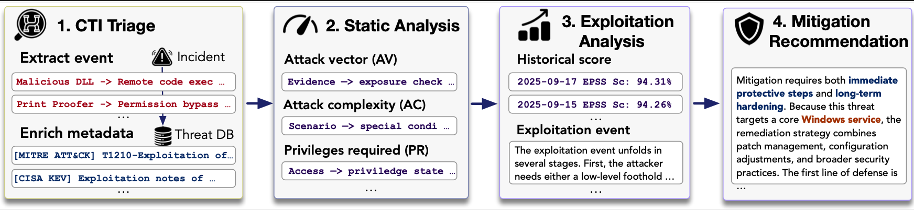

# 🛡️ POLAR: Automating Cyber Threat Prioritization Through LLM-Powered Assessment

> An LLM-based Framework for End-to-End Vulnerability Assessment and Mitigation
## 🎯 Overview

**POLAR** is an LLM-based framework that automates end-to-end cyber threat prioritization, addressing the critical challenge of managing new vulnerabilities reported annually. The framework transforms unstructured threat intelligence into structured severity metrics, forecasts exploitation likelihood through temporal narratives, and generates prioritized remediation strategies.

*Figure 1: POLAR integrates real-world threat incidents with external databases to assess threats and recommend mitigations*


### Key Achievements
| Metric | Improvement | Description |
|--------|-------------|-------------|
| **CTI Extraction** | **↑ 71.9%** | F1 score improvement for threat indicator extraction |
| **CVSS Accuracy** | **↑ 43.5%** | Improvement in static severity scoring |
| **EPSS Prediction** | **↓ 22.4%** | Reduction in exploitation prediction RMSE |
| **Mitigation NDCG@5** | **↑ 50.8%** | Improvement in mitigation recommendation ranking |

---

## 🔧 Pipeline Architecture

*Figure 2: Four-stage sequential pipeline from CTI triage to mitigation recommendation*

## 🔁 Four Sequential Stages

POLAR follows a four-stage pipeline to prioritize threats from raw CTI to actionable mitigation:

---

### 1. 🧩 CTI Triage

Extract and disentangle individual threat events from noisy CTI reports.  
LLMs enrich each instance with metadata such as CVE ID, MITRE ATT&CK TTPs, and CISA KEV tags.

> 🛠️ *Example:*  
> `{"CVE": "2021-34527", "Pattern": "DLL hijacking", "TTP": "T1210"}`

---

### 2. 📐 Static Analysis

Map each threat to **CVSS v3.1 metrics** via LLM reasoning.  
LLMs justify values for AV, AC, PR, UI, CIA, etc., then compute severity with the CVSS formula.

> 🧮 *Example:*  
> `AV:N/AC:L/PR:L/UI:N/S:U/C:H/I:N/A:N → Score: 7.5`

---

### 3. 📈 Exploitation Analysis

Forecast short-term exploit risk using signals like PoC presence, KEV listings, and vendor telemetry.  
LLMs produce a 30-day likelihood estimate with reasoning over exploitation narratives.

> 📊 *Example:*  
> `EPSS-like score: 94.3% (High risk)`

---

### 4. 🛡️ Mitigation Recommendation

Retrieve and rank mitigation actions from trusted sources (e.g., NVD, ATT&CK, vendor bulletins).  
LLMs tailor strategies based on severity and likelihood.

> 📋 *Example:*  
> 1. Apply KB5004945 patch  
> 2. Disable Print Spooler via GPO  
> 3. Block RPC over SMB

---

---

## 📁 Repository Structure

The repository is organized into the following core directories:

* `RQ1_Experiments/` – CTI triage extraction and metadata enrichment experiments
* `RQ2_Experiments/` – Static analysis with CVSS metric prediction and severity scoring  
* `RQ3_Experiments/` – Exploitation analysis with EPSS forecasting experiments
* `RQ4_Experiments/` – Mitigation recommendation and prioritization evaluation
* `prompts/` – LLM prompt templates for each analysis stage
* `enhanced_threat_reports/` – Enriched threat intelligence data
* `GT_Data/` – Ground truth datasets for evaluation
* `figures/` – Visualizations and result charts used in documentation

Each module reflects a key research question in the threat prioritization workflow—from raw CTI extraction to exploitation prediction and mitigation recommendation.

---

## 🚀 Guide

We organize the codebase into four modular stages reflecting key steps in vulnerability assessment:

1. `RQ1_Experiments/` – CTI triage and threat indicator enrichment  
2. `RQ2_Experiments/` – CVSS severity scoring via LLMs  
3. `RQ3_Experiments/` – EPSS exploitation forecasting  
4. `RQ4_Experiments/` – Mitigation recommendation generation and ranking  

> 📌 Full running instructions (including parameter details and sample configs) will be released upon acceptance or public dissemination of the project.


## 🤖 Supported Models

### General-Purpose LLMs
```python
MODELS = {
    "gpt-4o": g4f.models.gpt_4o,
    "gpt-4": g4f.models.gpt_4,
    "gpt-4o-mini": g4f.models.gpt_4o_mini,
    "gemini-1.5-pro": g4f.models.gemini_1_5_pro,
    "gemini-1.5-flash": g4f.models.gemini_1_5_flash,
    "llama-3.1-70b": g4f.models.llama_3_1_70b,
    "claude-4.1": g4f.models.claude_opus_4_1,
    "qwen3-30b": g4f.models.qwen3_30b
}
```

### Security-Specialized Models
- **Foundation-Sec-8B** (FS8B)
- **Lily-Cybersecurity-7B** (LY7B)
- **ZySec-7B** (ZY7B)

---


## 📈 Performance Metrics

### Evaluation Dimensions

| Stage | Metrics | Description |
|-------|---------|-------------|
| **CTI Triage** | F1, Precision, Recall | Entity extraction accuracy |
| **CVSS Analysis** | Accuracy, RMSE| Severity scoring precision |
| **EPSS Forecasting** | RMSE,Direction Accuracy | Exploitation prediction |
| **Mitigation** | NDCG@k, Kendall's τ | Ranking quality |


---

## 🔍 Implementation Notes

- **Caching**: Results cached incrementally to prevent data loss
- **Rate Limiting**: Random delays (1.2-2.4s) between API calls
- **Fallback**: Invalid predictions revert to baseline methods
- **Reproducibility**: Fixed random seeds (42) for consistent results

---

## 📚 Related Work

POLAR advances beyond existing frameworks:
- **CVSS (FIRST, 2019)**: Static scoring → We add temporal dynamics
- **EPSS (Jacobs et al., 2021)**: Binary prediction → We provide reasoning chains
- **Rule-based systems (Snort/Suricata)**: Fixed patterns → We enable adaptive reasoning

---

## 🛡️ License

This project is provided for research purposes under the MIT License.

---

## 🙏 Acknowledgments

- **FIRST.org** for CVSS and EPSS frameworks
- **NIST NVD** for vulnerability data
- **MITRE** for ATT&CK and CVE databases
- **CISA** for KEV catalog

---

<div align="center">
  <sub>Built with dedication for advancing cybersecurity research</sub>
</div>